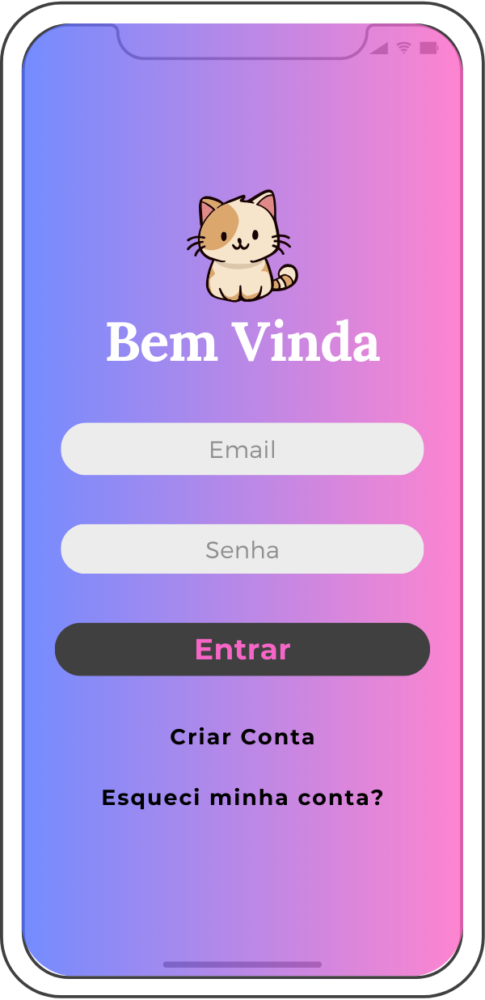

# App de Criptomoedas para Mulheres

Projeto acadêmico desenvolvido para a disciplina de Projeto de Interface (IESB).

##  Objetivo

Criar uma proposta de aplicativo de criptomoedas com foco em acessibilidade, educação e empoderamento feminino no universo cripto.

##  Público-alvo

Mulheres iniciantes em finanças e tecnologia que desejam aprender e investir de forma segura e acolhedora.

##  Escolhas de Design

- Paleta em tons pastéis (azul, lilás e rosa claro)
- Tipografia: Lora (títulos) + Montserrat (texto)
- Navegação intuitiva e botões grandes
- Ilustrações e mascote simpático para criar vínculo

##  Telas do projeto

##  Documento completo

Você pode ver o PDF com todos os detalhes [aqui](./Projeto_UI_Criptomoedas.pdf).
